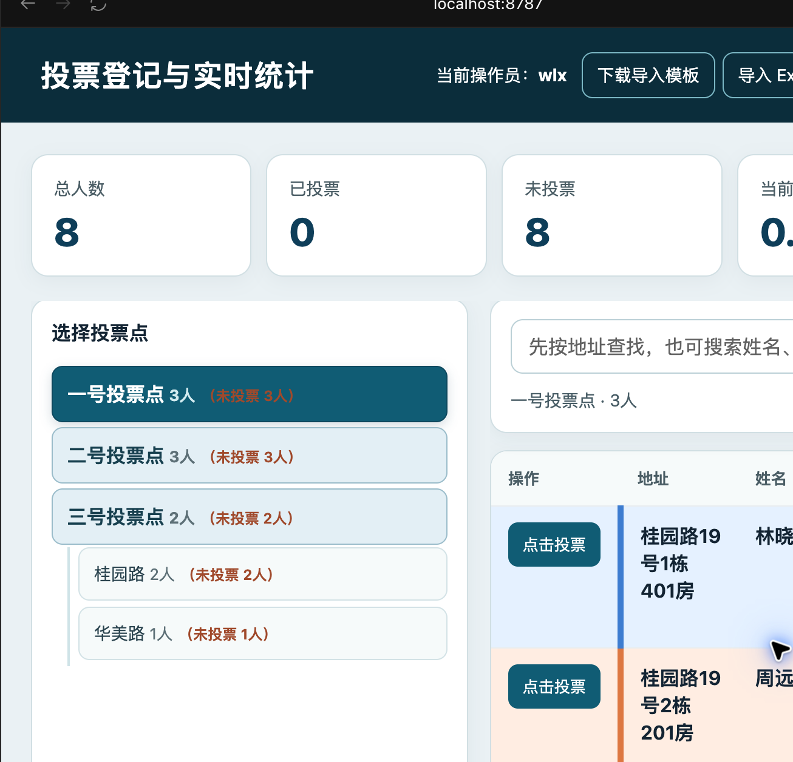

# 投票登记与实时统计系统：使用说明

## 1. 项目简介

当投票分布在多个地点、多个地区分别进行时，工作人员往往无法实时共享各地点的投票进度，负责人也难以及时知道每个地点、每个地区还有多少人未投票；依靠纸张、表格或人工汇总还容易出现重复登记和统计延迟。

本系统正是针对这个痛点设计的：把人员基础数据、投票状态和实时统计集中到同一个网页中，让多个地点的工作人员同时登记，负责人实时掌握整体和分组进度。

本系统用于在现场投票、民主测评、换届登记或类似人员确认工作中，快速完成以下工作：

1. 登录后按投票点和地区筛选人员。
2. 搜索姓名、地址、电话或备注。
3. 点击人员进行投票登记。
4. 查看某个投票点、某个地区以及整体的已投票和未投票人数。
5. 必要时撤销误操作，并保留操作记录。

系统采用浏览器访问，不需要在每台电脑上安装独立客户端。手机浏览器和电脑浏览器均可使用。

### 1.1 产品卖点

- **解决多个投票点无法实时共享数据的问题**：所有设备访问同一个服务，任一投票点登记后，其他设备会收到最新状态和统计。
- **减少人工汇总和重复登记**：服务端统一判断投票状态，自动统计总人数、已投票、未投票和投票率。
- **适合现场协作**：工作人员可按投票点、分组或关键词快速定位人员，负责人可实时掌握整体进度。
- **可追溯、可纠错**：投票记录包含操作员和时间，误登记可以撤销，便于事后核对。
- **从 Excel 快速开始**：电脑端提供标准模板和导入预览，客户无需手工改代码即可准备新一轮名单。

主页面示例（虚构数据）：



## 2. 功能特点

### 2.1 分组查找

人员可以按投票点和地区归类。现场工作人员先选择投票点，再选择地区，可以缩小人员范围，避免在全部人员中逐一查找。

### 2.2 多条件搜索

搜索框支持根据姓名、地址、电话或备注查找。适合选民只记得姓名、工作人员只知道门牌号，或者需要根据备注核对身份的场景。

### 2.3 投票状态登记

点击“点击投票”后，系统记录人员的投票状态、操作员账号和时间。已经登记的人员会显示为已投票，避免重复登记。

### 2.4 撤销误操作

如果误点了人员，可以点击“撤销”恢复为未投票状态。撤销本身也会写入操作记录，方便事后核对。

### 2.5 实时统计

页面显示总人数、已投票、未投票和当前投票率；投票点和地区列表同时显示该分组的总人数及未投票人数，便于现场掌握进度。

### 2.6 多设备协作

多个工作人员可以同时使用。生产环境由 Supabase 负责保存投票状态，数据库事务和唯一约束保证同一人员的并发登记不会被重复写入。

### 2.7 数据不直接公开

人员数据不放在 `public/` 静态目录中。运行时使用受保护的 API 读取本地数据，直接访问 `/data/people.local.json` 不会返回人员名单。

## 3. 适用范围

本系统适合以下场景：

- 人大换届选举等现场投票登记。
- 村、社区、街道等基层民主测评。
- 工会、协会、业委会等人员表决登记。
- 会议签到、人员确认和分组进度统计。
- 需要按地区、楼栋、网格或小组追踪完成情况的活动。

不建议直接用于以下场景：

- 需要法律意义上的电子投票、加密选票或匿名投票的正式在线选举。
- 需要严格身份认证、短信实名核验或电子签名的业务。
- 没有专人负责账号、数据和服务器安全的公开互联网服务。

本系统的定位是“现场工作人员辅助登记与统计工具”，不是完整的电子投票平台。

## 4. 推荐使用流程

### 4.1 准备阶段

1. 整理人员基础数据。
2. 确认每个人都有唯一 `id`。
3. 检查投票点、地区、姓名、电话和备注是否准确。
4. 为每名工作人员设置独立账号和强密码。
5. 在测试环境先验证登录、搜索、投票和撤销。

### 4.2 现场使用阶段

1. 打开系统网址。
2. 输入操作员账号和密码。
3. 选择投票点和地区。
4. 通过姓名、地址、电话或备注搜索人员。
5. 点击人员姓名查看电话和备注，完成身份核对。
6. 点击“点击投票”登记。
7. 发现误操作时点击“撤销”。
8. 根据左侧分组统计查看还有多少人未投票。

### 4.3 收尾阶段

1. 按投票点和地区核对未投票名单。
2. 检查异常记录和撤销记录。
3. 导出或备份需要留存的统计结果。
4. 活动结束后修改或停用现场账号。

## 5. 账号和权限

账号由项目部署者根据实际工作人员数量配置。不同账号可以分别分配给不同地点或工作人员，便于追踪操作记录。当前版本没有独立的角色权限系统；如果需要真正的管理员后台、只查看未投票人员、导出报表或管理账号，需要继续开发权限角色和管理页面。

Vercel 环境可以使用以下格式的变量覆盖密码：

```text
OPERATOR_<账号>_PASSWORD
```

## 6. 基础数据格式

系统使用 `data/people.local.json` 作为运行数据。首次启动时，如果该文件不存在，系统会从 `data/people.example.json` 创建。每条人员记录至少应包含以下字段：

```json
{
  "id": "person-0001",
  "point": "一号投票点",
  "group": "花地二街",
  "address": "示例地址",
  "name": "示例姓名",
  "phone": "13800000000",
  "note": "备注"
}
```

数据要求：

- `id` 必须唯一且稳定，不能用姓名作为唯一 ID。
- `point` 和 `group` 用于分组统计。
- 身份证号、电话和备注属于个人信息，发布前应删除或脱敏。
- 修改基础数据后，应重新检查总人数、投票点人数和地区人数。
- 不要把现场数据文件 `data/people.local.json` 和状态文件 `runtime/state.json` 提交到 GitHub。

### 6.1 Excel 导入

电脑端登录后可以下载 `people-import-template.xlsx`。请只在“人员数据”工作表填写，第一行表头保持不变。必填字段为编号、投票点、分组、地址和姓名；身份证号、电话和备注为可选字段。

点击“导入 Excel”后，系统会先读取、校验并展示预览。确认后才会替换人员名单，同时清空当前投票状态和操作记录。导入新一轮名单前，请先备份 `data/people.local.json`。

Excel 导入功能面向本地 Node.js 运行模式。Vercel 示例 API 使用示例数据，不提供写入本地 Excel 导入结果的能力。

## 7. 本地运行

环境要求：Node.js 18 或更高版本。

```bash
cd /path/to/voting-monitor
npm install
npm run start:demo
```

浏览器打开：

```text
http://localhost:8787
```

如果 `localhost` 打不开，先确认终端仍显示服务正在运行，再尝试 `http://127.0.0.1:8787`。如果提示端口占用，可执行 `PORT=8788 npm run start:demo`，然后访问 `http://127.0.0.1:8788`。其他手机或电脑访问时，应使用运行服务电脑的局域网 IP，而不是各自设备上的 `localhost`。

启动检查命令：

```bash
curl -I http://127.0.0.1:8787
```

本地版本：

- 人员数据来自 `data/people.local.json`。
- 投票状态和操作记录写入 `runtime/state.json`。
- `runtime/` 已加入 `.gitignore`。
- 多个设备需要访问同一台电脑的局域网地址，并确保端口可访问。

## 8. Vercel + Supabase 部署

### 8.1 Supabase

1. 创建 Supabase 项目。
2. 在 SQL Editor 执行 [`../supabase/schema.sql`](../supabase/schema.sql)。
3. 确认 `voter_status` 和 `operation_logs` 表创建成功。

### 8.2 Vercel 环境变量

至少配置：

| 变量 | 作用 |
|---|---|
| `SUPABASE_URL` | Supabase 项目地址 |
| `SUPABASE_SERVICE_ROLE_KEY` 或 `SUPABASE_SECRET_KEY` | 服务端访问 Supabase 的密钥 |
| `SESSION_SECRET` | 登录会话签名密钥 |
| `OPERATOR_*_PASSWORD` | 覆盖各操作员密码 |

服务端密钥和 `SESSION_SECRET` 只能保存在 Vercel Environment Variables，不能写入 GitHub、前端代码或截图。

### 8.3 部署后检查

部署完成后至少验证：

1. 首页可以打开。
2. 错误账号会被拒绝。
3. 正确账号可以登录。
4. 登录后能读取人员和统计数据。
5. 直接访问 `/data/people.local.json` 不会返回人员数据。
6. 测试环境完成一次投票和撤销后，再开始正式使用。

## 9. 开源前准备

如果以后要把项目做成开源模板，建议按以下顺序处理：

1. 不要提交真实的 `data/people.local.json`，只保留不含个人信息的 `data/people.example.json`。
2. 删除根目录中的原始 Excel、截图、导出文件和现场备份。
3. 清理 `runtime/state.json`、日志、部署产物和临时文件。
4. 检查 Git 历史，确认旧提交中没有个人数据、手机号、地址或密钥；必要时重写历史。
5. 撤销并重新生成所有 Supabase、Vercel 和 GitHub 密钥。
6. 把账号改成环境变量或首次启动时配置，不要在源码中保留现场账号密码。
7. 在 README 中明确隐私责任、数据保存位置和适用范围。
8. 用示例数据完成一次全流程测试后，再把仓库设为公开。

开源版本建议只保留：程序代码、数据库结构、示例数据、部署说明和测试说明；不要保留任何真实人员名单。

## 10. 已知边界

- 当前账号都是操作员账号，没有真正的角色权限系统。
- 当前系统不是匿名电子投票系统，不提供选票加密或选民实名认证。
- Vercel 版本依赖 Supabase 可用性，数据库异常时需要稍后重试。
- 生产环境的真实投票数据应由项目负责人负责备份、访问控制和合规管理。

## 11. 开发检查

提交代码前建议执行：

```bash
node --check server.js
node --check api/'[[...path]].js'
node --check public/app.js
git diff --check
```

不要把真实人员数据和生产密钥提交到 GitHub。
